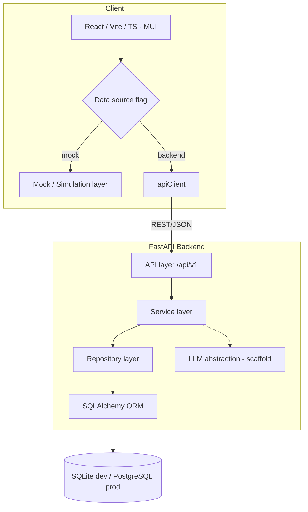
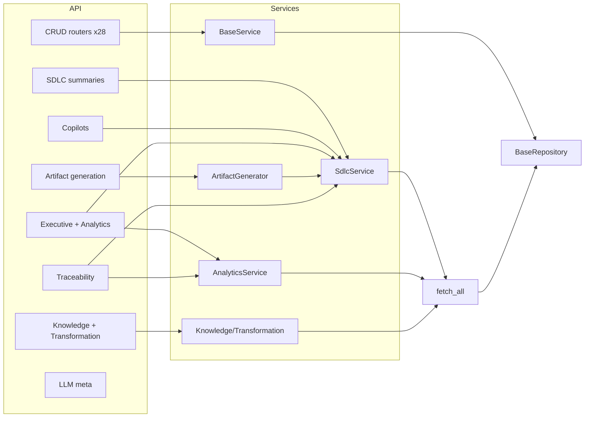
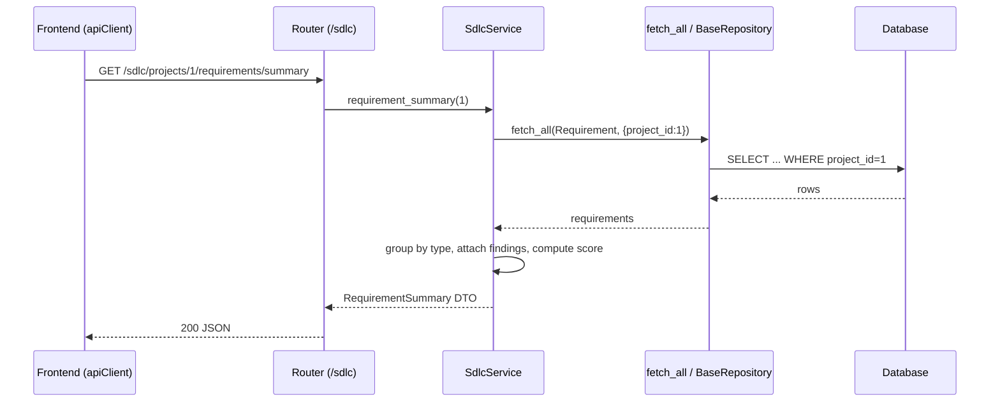
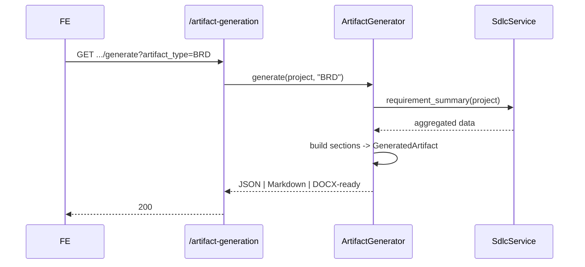
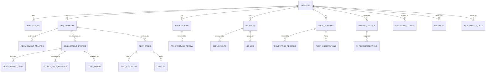
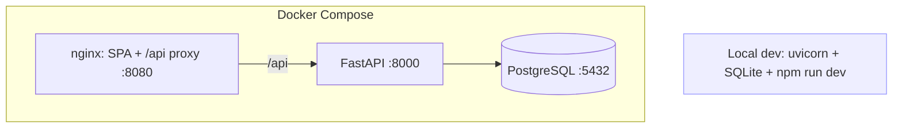
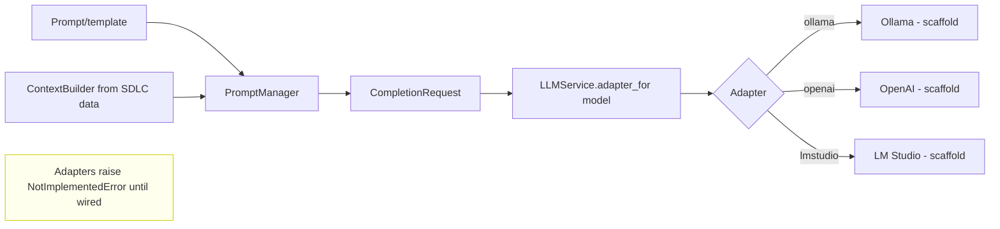

# ADIP — Solution Architecture (Phase 14)

## Logical architecture

## Component diagram

## Sequence — business summary request

## API flow — artifact generation

## Database ER (high level)

## Deployment architecture

## AI orchestration flow (future-ready)

