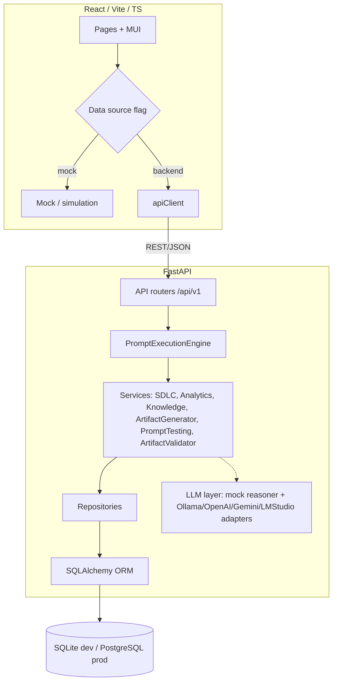

# Architecture Overview

## Prompt-to-delivery flow

- **PromptExecutionEngine** orchestrates all existing services (no duplication).
- **ArtifactGenerator** produces 47 artifact types (JSON / Markdown / DOCX / PDF-ready).
- **LLM layer** is provider-independent; mock by default (offline), Ollama for real local execution.

Deep dive: [`../04_Architecture/07_SOLUTION_ARCHITECTURE.md`](../04_Architecture/07_SOLUTION_ARCHITECTURE.md).
