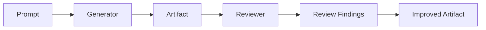

# AI Reviewer Guide

The AI Reviewer critiques generated artifacts and proposes improvements.

## Flow



## Reviewer checks

business accuracy · SDLC completeness · architecture quality · regulatory
completeness · test coverage · risk coverage · traceability · hallucination
risk · missing assumptions · executive clarity.

## Modes

- **Deterministic** (default): derives findings from the quality engine +
  heuristics. Works with **no live LLM**.
- **Ollama**: when `LOCAL_LLM_ENABLED=true` and the provider is reachable, builds
  a reviewer prompt and calls the model, then blends with the deterministic
  baseline for guaranteed structure. Falls back to deterministic on any failure.

## APIs

| API | Purpose |
|---|---|
| `POST /api/v1/ai-review/review-artifact` | Generate + review one artifact |
| `POST /api/v1/ai-review/improve-artifact` | Review + return improved artifact + changes |
| `POST /api/v1/ai-review/review-run` | Orchestrate a prompt + review all artifacts |

## Example

```bash
curl -s -X POST http://localhost:8000/api/v1/ai-review/review-artifact \
  -H 'Content-Type: application/json' -d '{"project_id":1,"artifact_type":"HLD"}'
```
```jsonc
{
  "reviewer": "deterministic", "review_score": 86,
  "findings": [{ "dimension": "regulatory_completeness", "severity": "medium",
                 "finding": "...", "recommendation": "..." }],
  "hallucination_risk": "Low", "missing_assumptions": [], "executive_clarity": "..."
}
```

## Test commands (with mocked LLM)

```bash
cd backend && pytest -k "review"
```

The tests exercise the deterministic path and a mocked Ollama response so they
run without a live model.
