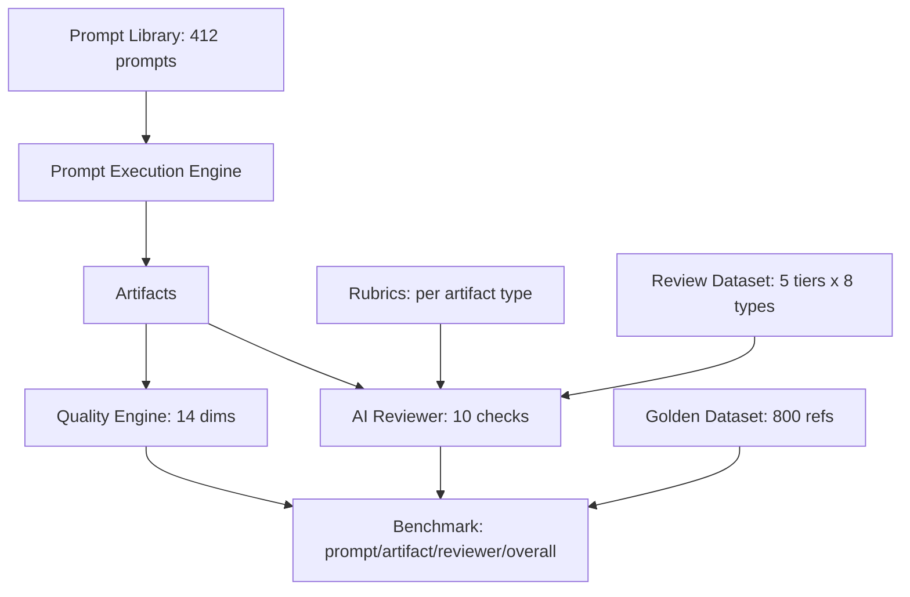

# AI Evaluation Guide

How ADIP measures and improves AI output quality end-to-end.

## The evaluation stack



## Components

| Component | What | Where |
|---|---|---|
| Prompt Library | 25 use-case + 27 authoring + 360 matrix prompts | `GET /api/v1/prompt-templates*` |
| Golden Dataset | 800 reference artifacts (100 × 8 types) | `docs/examples/golden-dataset/` |
| Quality Engine | 14-dimension artifact scoring | `POST /api/v1/artifact-quality/score` |
| Rubrics | 10-criterion evaluation rubric per type | `GET /api/v1/artifact-rubrics/{type}` |
| Review Dataset | Excellent→Broken graded examples | `docs/examples/review-dataset/` |
| AI Reviewer | 10-check critique (deterministic / Ollama) | `POST /api/v1/ai-review/*` |
| Benchmark | prompt/artifact/reviewer/overall scoring | `POST /api/v1/prompt-benchmark/run` |
| Optimization | V1/V2/V3 compare + recommendations | `POST /api/v1/prompt-benchmark/optimize` |
| Walkthroughs | 20 end-to-end examples | `docs/examples/walkthroughs/` |

## Evaluation workflow

1. Author/select a prompt (`prompt-templates`).
2. Execute + score artifacts (`artifact-quality`).
3. Review (`ai-review`) against rubrics.
4. Benchmark versions and optimize (`prompt-benchmark`).
5. Compare to the golden dataset for regression.

## Test commands

```bash
cd backend && pytest -k "benchmark or rubric or quality or review or matrix"
```

Related: [Prompt Benchmark Guide](Prompt%20Benchmark%20Guide.md) ·
[Golden Dataset Guide](Golden%20Dataset%20Guide.md) ·
[Artifact Quality Guide](Artifact%20Quality%20Guide.md) ·
[Prompt Tuning Guide](Prompt%20Tuning%20Guide.md).
