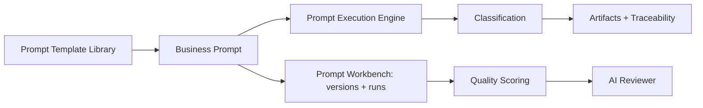

# Prompt Engineering Guide

ADIP turns a business prompt into a full AI SDLC run. This guide covers prompt
templates, the prompt workbench and prompt testing.

## Architecture



## APIs

| API | Purpose |
|---|---|
| `GET /api/v1/prompt-templates` | Ranked banking use-case templates (25) |
| `GET /api/v1/prompt-templates/artifacts` | Artifact-authoring templates (BRD, FRD, HLD, …) |
| `GET /api/v1/prompt-templates/artifacts/{artifact_type}` | One artifact-authoring template |
| `POST /api/v1/prompt-workbench/prompts` | Create a prompt (optional initial version) |
| `POST /api/v1/prompt-workbench/prompts/{id}/versions` | Add a prompt version/experiment |
| `POST /api/v1/prompt-workbench/runs` | Execute a prompt/version, capture metrics |
| `POST /api/v1/prompt-workbench/compare` | Compare two runs |
| `POST /api/v1/prompt-testing/run` · `/benchmark` | Ad-hoc run + benchmark |

## Request / response example

```bash
curl -s http://localhost:8000/api/v1/prompt-templates/artifacts/BRD
```
```jsonc
{
  "artifact_type": "BRD",
  "role_instruction": "You are a principal banking requirements specialist ...",
  "required_sections": ["Business Context", "Scope", "Assumptions", "..."],
  "quality_checklist": ["All required sections present", "No placeholder text", "..."],
  "json_schema_expectations": { "type": "object", "required": ["artifact_type", "title", "sections"] }
}
```

## Local LLM vs mock

Prompt classification uses a provider-independent reasoner. With
`LOCAL_LLM_ENABLED=false` (default) a deterministic mock reasoner is used and no
network call is made. Set `LOCAL_LLM_ENABLED=true` + `LLM_PROVIDER=ollama` to
use a local model (see [Local LLM setup](../../08_Local_LLM/Local%20LLM%20Artifact%20Generation.md)).

## Test commands

```bash
cd backend && pytest -k "workbench or prompt or template"
```

## Troubleshooting

- `no such table: workbench_prompts` → run `python -m app.seed.run --reset` (dev)
  or `alembic upgrade head` (Postgres).
- Empty run metrics → the prompt failed classification; check the `error` field.

## Developer workflow

1. Draft a prompt (or start from a template).
2. Save it in the workbench; iterate with versions/experiments.
3. Run each version; compare quality/latency/coverage.
4. Review the generated artifacts (AI Reviewer) and improve.
