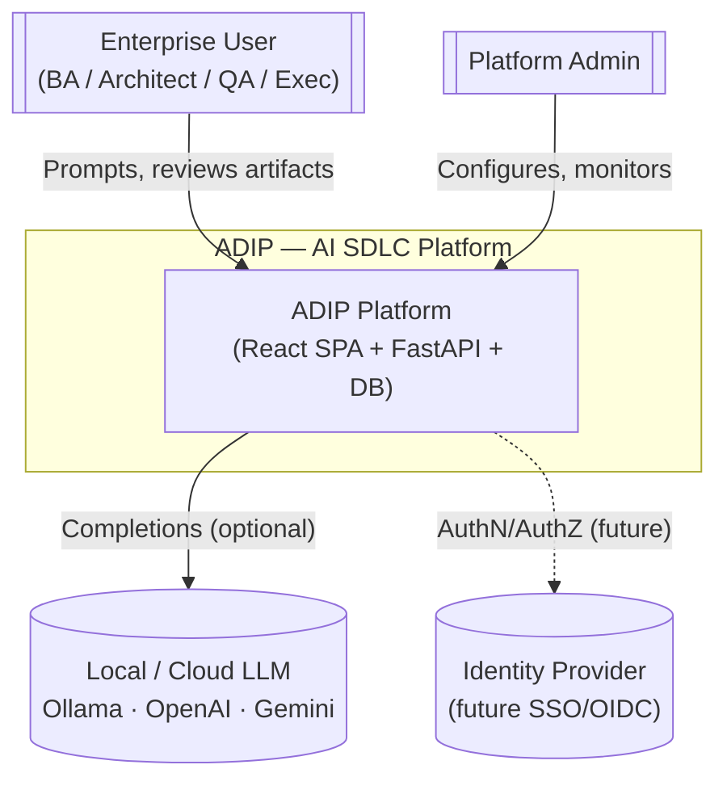
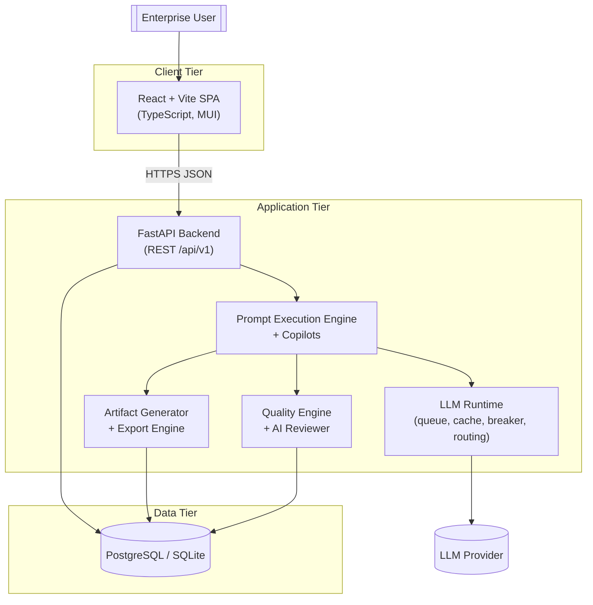
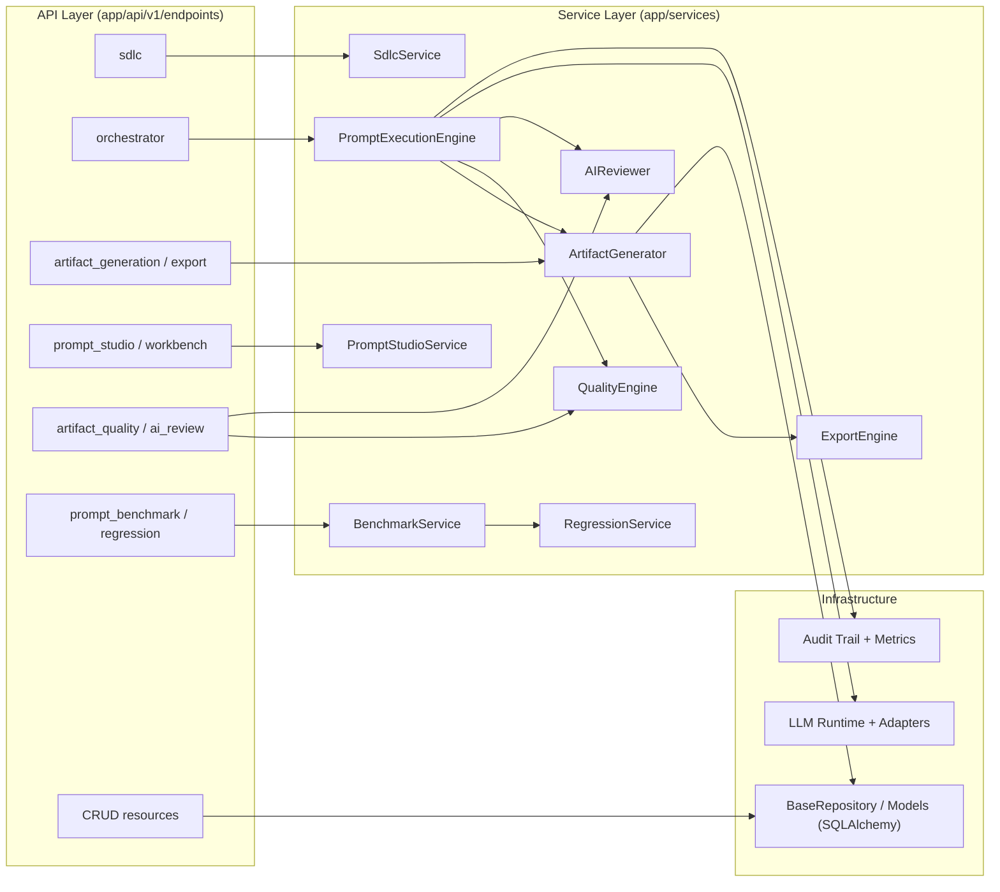
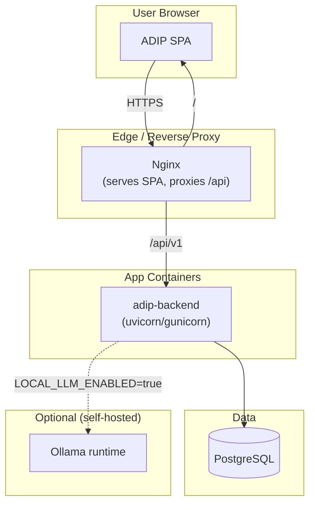
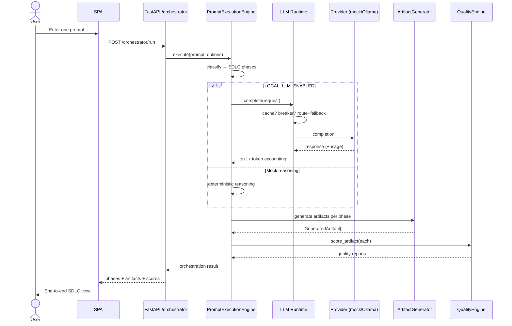
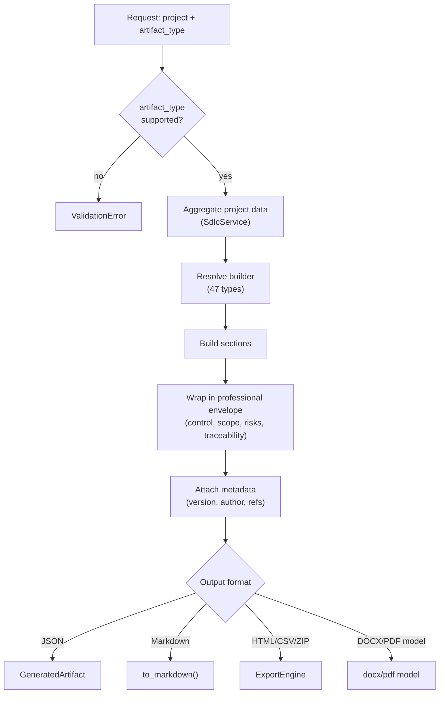
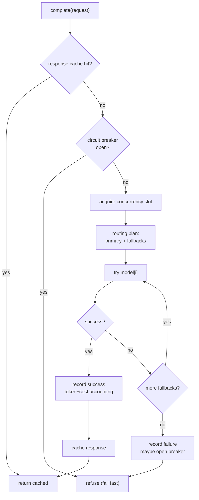
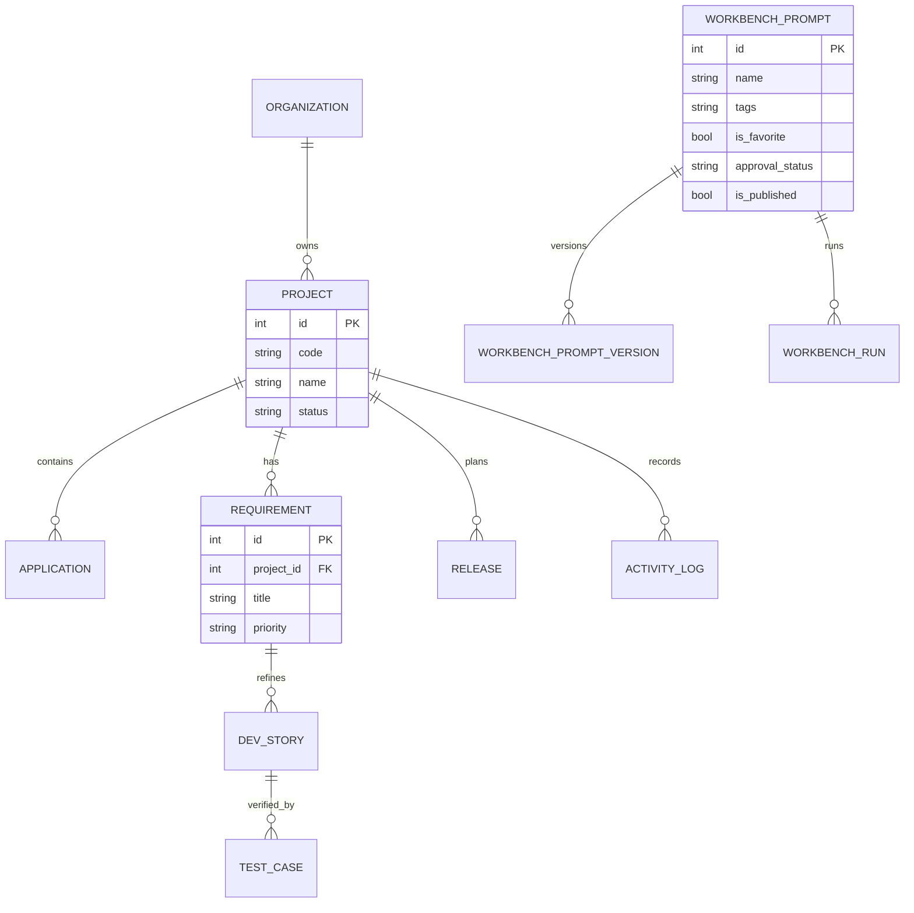

# ADIP Architecture Diagrams — C4, Components & Flows

Comprehensive architecture diagrams for ADIP in **Mermaid** (renders on GitHub)
and **PlantUML** (for tooling that supports it). Covers C4 context/container,
component, deployment, sequence, database ER, and the three core AI flows
(prompt execution, artifact generation, LLM orchestration).

> This complements `DIAGRAMS.md`; it does not replace it. This file is the
> canonical source for the C4 model and the AI flow diagrams.

---

## 1. C4 — Level 1: System Context



### PlantUML (C4 Context)

```plantuml
@startuml
!include https://raw.githubusercontent.com/plantuml-stdlib/C4-PlantUML/master/C4_Context.puml
Person(user, "Enterprise User", "BA, Architect, QA, Executive")
Person(admin, "Platform Admin")
System(adip, "ADIP", "AI SDLC platform: prompt-driven requirements to go-live")
System_Ext(llm, "LLM Provider", "Ollama / OpenAI / Gemini")
System_Ext(idp, "Identity Provider", "Future SSO / OIDC")
Rel(user, adip, "Prompts, reviews artifacts")
Rel(admin, adip, "Configures, monitors")
Rel(adip, llm, "Completions (optional)")
Rel(adip, idp, "AuthN/AuthZ (future)")
@enduml
```

---

## 2. C4 — Level 2: Container



---

## 3. C4 — Level 3: Component (Backend)



---

## 4. Deployment Diagram



### PlantUML (Deployment)

```plantuml
@startuml
node "User Browser" { artifact "ADIP SPA" as spa }
node "Nginx" as nginx
node "Backend Container" { component "FastAPI (uvicorn)" as be }
database "PostgreSQL" as pg
node "Ollama (optional)" as ollama
spa --> nginx : HTTPS
nginx --> be : /api/v1
be --> pg
be ..> ollama : optional completions
@enduml
```

---

## 5. Prompt Execution Flow (Sequence)



---

## 6. Artifact Generation Flow



---

## 7. LLM Orchestration Flow (Runtime)



---

## 8. Database ER (Core Entities)



> The full ER schema is derived from `backend/app/models/`. Regenerate a
> detailed ER with any SQLAlchemy-aware ERD tool pointed at the models package.

---

## How to render

- **Mermaid**: renders automatically on GitHub and in most Markdown viewers.
- **PlantUML**: use the PlantUML CLI/server, or the C4-PlantUML includes shown above.
