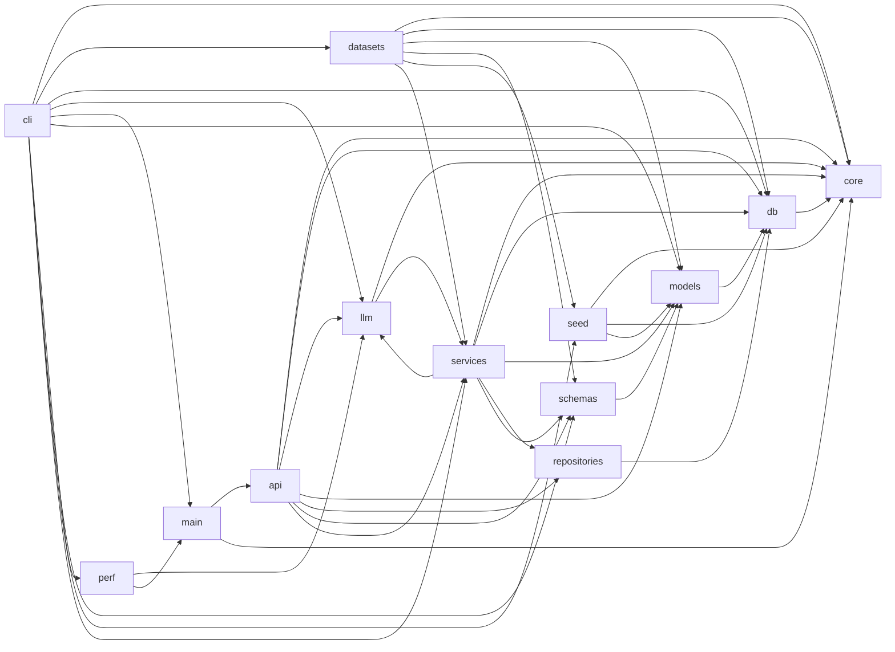

# ADIP Architecture Review, Gap Analysis & Quality Score

A principal-architect review of the ADIP platform: current architecture,
dependency graph, scalability/extensibility assessment, gaps, and a scored
quality rubric. Complements the C4/flow diagrams in
`Architecture Diagrams (C4 and Flows).md` and the ADRs in `ADR/`.

---

## 1. Architecture summary

- **Frontend:** React + Vite + TypeScript SPA (MUI), served by Nginx.
- **Backend:** FastAPI, strict layering — endpoints → services → repositories/models
  (ADR-0001), with a separate `app/llm/` package (ADR-0002).
- **Data:** SQLAlchemy + Alembic; SQLite (dev) / PostgreSQL (prod) (ADR-0004),
  additive-only migrations (ADR-0006).
- **AI:** provider-agnostic LLM abstraction (ADR-0002) with a resilience runtime
  (ADR-0005); mock-first deterministic mode (ADR-0003).
- **Scale of surface:** ~154 REST paths, ~20 services, ~190 backend tests.

---

## 2. Module dependency graph (actual, from imports)

**Layering health:** clean top-down flow overall. **One smell:**
`llm/context_builder.py` imports `SdlcService` (services), while `services`
imports `llm` — a bidirectional package edge. It is **not** a runtime cycle
(services never imports `context_builder`; the app imports cleanly and all tests
pass), but it is a layering inversion.

**Recommendation:** move `ContextBuilder` out of `app/llm/` into `app/services/`
(it is a service that assembles context from SDLC data), leaving `app/llm/`
free of any `services` dependency. Low effort, no behavior change.

---

## 3. Scalability review

| Dimension | Assessment | Notes |
|---|---|---|
| Statelessness | Strong | Backend is stateless; scale horizontally behind Nginx/LB. |
| Database | Good | PostgreSQL for prod; add read replicas + connection pooling for scale. Index/partition assets provided in `docs/11_Database/`. |
| LLM throughput | Good | Runtime provides concurrency limits, caching, batching; scale by adding provider replicas + routing. |
| Caching | Adequate | In-process LRU today; promote to Redis for multi-replica cache sharing (seam documented). |
| Background work | Gap → addressed | Retry framework added; heavy/async jobs should move to a task queue (Celery/RQ) — documented as a seam. |
| Frontend | Good | Static SPA, CDN-cacheable; large bundle → code-splitting recommended (not a blocker). |

---

## 4. Extensibility review

Extension points are documented in `docs/14_Extensibility/Extensibility Guide.md`
and the plugin architecture in `Plugin Architecture.md`. Strengths:

- **Providers:** new LLM providers via one adapter (ADR-0002).
- **Resources:** new CRUD entities via the factory + `app.cli scaffold`.
- **Routers:** new capabilities are additive `APIRouter`s aggregated centrally.
- **Config-gated features:** integrations default off; mock mode always works.

Planned seams: MCP, agent framework, cloud LLM, RAG, vector DB, workflow engine,
plugin marketplace.

---

## 5. Gap analysis (and disposition)

| Area | Status before | Disposition |
|---|---|---|
| ADRs | Missing | **Added** (`ADR/`) |
| Module dependency graph | Missing | **Added** (this doc) |
| DBA production assets (indexes, health, backup) | Missing | **Added** (`docs/11_Database/`, `backend/scripts/db/`) |
| ML evaluation pipeline / drift / experiments | Missing | **Added** (`app/ml/`) |
| Prompt cookbook / anti-patterns | Missing | **Added** (`docs/02_AI_SDLC/Prompt Engine/`) |
| Rate limiting / retry framework | Missing | **Added** (`app/core/`) |
| K8s / Helm / Terraform | Missing | **Added** (`deploy/`) |
| Prometheus / Grafana / alerts / SLOs | Missing | **Added** (`deploy/observability/`, `docs/09_Operations/`) |
| Security (SECURITY.md, OWASP, threat model, SBOM) | Missing | **Added** (`SECURITY.md`, `docs/15_Security/`) |
| Postman / API examples | Missing | **Added** (`docs/10_API/`) |
| `llm → services` layering inversion | Present | **Documented** (recommend relocating `ContextBuilder`) |

---

## 6. Architecture quality score

Scored 1–5 per dimension (5 = excellent). Weighted overall.

| Dimension | Weight | Score | Rationale |
|---|--:|--:|---|
| Modularity & layering | 15% | 4.5 | Strong layering; one documented inversion. |
| Separation of concerns | 10% | 5.0 | Endpoints/services/repos cleanly separated. |
| Extensibility | 15% | 4.5 | Protocols, factory, additive routers, config gates. |
| Testability | 15% | 5.0 | 190 offline deterministic tests; mock-first. |
| Scalability | 10% | 4.0 | Stateless; needs Redis/task-queue for large scale. |
| Resilience | 10% | 4.5 | Circuit breaker, retries, fallback, timeouts. |
| Observability | 10% | 4.0 | Metrics/health/runtime + dashboards; tracing is a seam. |
| Security | 10% | 3.5 | Hardening + docs added; authN/authZ is a future seam. |
| Documentation | 5% | 5.0 | Extensive, indexed, ADR-backed. |

**Weighted overall: 4.45 / 5.0 — "Production-ready with known, documented follow-ups."**

Biggest levers to reach 4.7+: (1) relocate `ContextBuilder`; (2) Redis cache +
task queue; (3) authN/authZ + rate limiting enforcement in production.

---

## 7. Technology & future roadmap (summary)

- **Near term:** enforce rate limiting in prod, wire OpenTelemetry, Redis cache.
- **Mid term:** cloud LLM adapters, RAG + vector DB, agent framework.
- **Long term:** multi-tenant isolation, plugin marketplace, workflow engine.

See `docs/14_Extensibility/Extensibility Guide.md` and `Plugin Architecture.md`.
