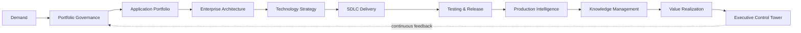
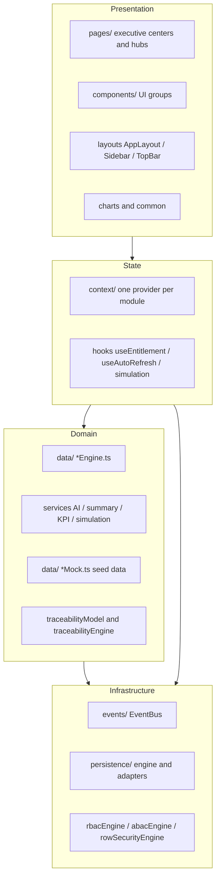
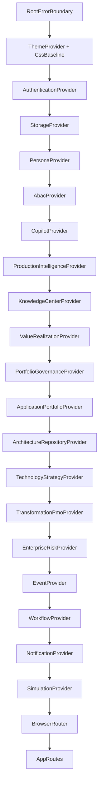
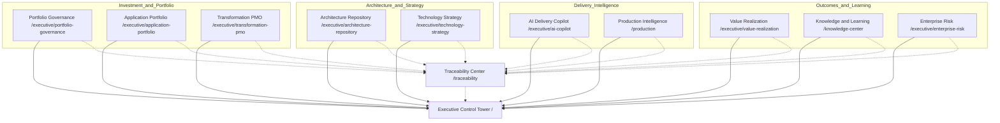
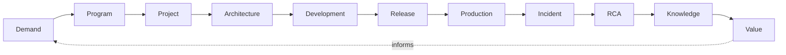
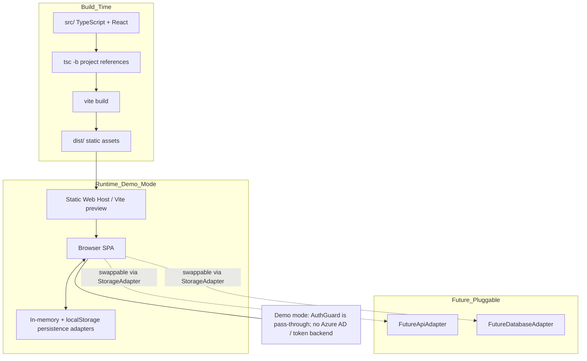
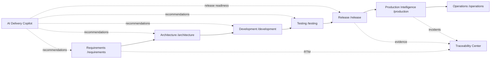
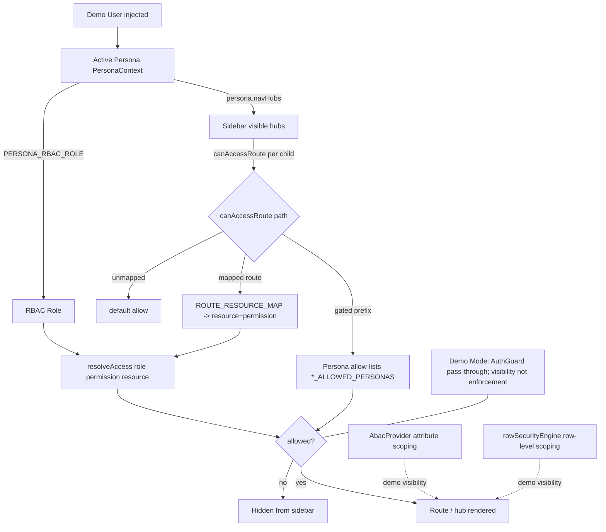

# ADIP Architecture & Flow Diagrams

Mermaid diagrams generated from the actual implementation. Sources referenced:
`src/App.tsx`, `src/routes/index.tsx`, `src/config/navConfig.ts`,
`src/config/personaConfig.ts`, `src/data/rbacCatalog.ts`, `src/data/rbacEngine.ts`,
`src/data/traceabilityModel.ts`, `src/persistence/*`, `src/events/*`.

> Render these in any Mermaid-capable viewer (GitHub, VS Code Mermaid preview, etc.).

---

## 1. Business Flow

The enterprise delivery value chain modeled by ADIP.

---

## 2. System Architecture

Layered structure of the client-side SPA.

---

## 3. Provider Hierarchy

Exact composition from `src/App.tsx` (outermost to innermost).

---

## 4. Executive Center Relationships

The 10 executive modules feeding the Control Tower, linked by shared traceability.
Routes from `src/routes/index.tsx`.

---

## 5. End-to-End Traceability

The lineage modeled in `src/data/traceabilityModel.ts` and surfaced by the Traceability Center.

---

## 6. Deployment Architecture

ADIP is a static SPA — build with Vite, serve the `dist/` bundle. No backend in demo mode.

---

## 7. SDLC Lifecycle

The SDLC Lifecycle Hub flow and its handoff into operations.
Routes: `/requirements`, `/architecture`, `/development`, `/testing`, `/release`, `/production`.

---

## 8. Governance Model

How visibility is resolved at runtime: persona → RBAC role → resource grants, plus
persona allow-lists for executive centers and ABAC/row-level scoping. All under demo mode.

