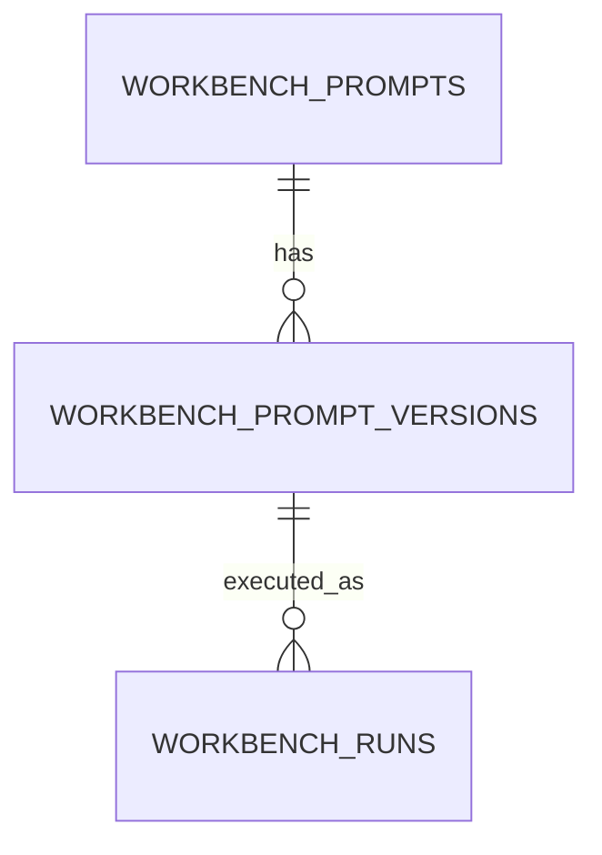

# Prompt Workbench

The Prompt Workbench is the backend for persistent prompt engineering:
**prompts → versions/experiments → runs → comparison**, with quality/latency/
token metrics captured on each run. Data is persisted (SQLite dev / PostgreSQL
prod) via the `workbench_prompts`, `workbench_prompt_versions` and
`workbench_runs` tables.

## Model



## APIs

| API | Purpose |
|---|---|
| `POST /api/v1/prompt-workbench/prompts` | Create a prompt |
| `GET /api/v1/prompt-workbench/prompts` · `/{id}` | List / get |
| `POST /api/v1/prompt-workbench/prompts/{id}/versions` | Add version/experiment |
| `GET /api/v1/prompt-workbench/prompts/{id}/versions` | List versions |
| `POST /api/v1/prompt-workbench/runs` | Execute a prompt/version, record metrics |
| `GET /api/v1/prompt-workbench/runs` · `/{id}` | List / get runs |
| `POST /api/v1/prompt-workbench/compare` | Compare two runs |

## Example workflow

```bash
# 1. Create a prompt with an initial version
PID=$(curl -s -X POST http://localhost:8000/api/v1/prompt-workbench/prompts \
  -H 'Content-Type: application/json' \
  -d '{"name":"UPI Reversal","content":"Implement UPI Auto-Reversal for Mobile Banking."}' | jq .id)

# 2. Add a refined version
curl -s -X POST http://localhost:8000/api/v1/prompt-workbench/prompts/$PID/versions \
  -H 'Content-Type: application/json' \
  -d '{"content":"Implement UPI Auto-Reversal with NPCI reconciliation and audit trail.","experiment":"more-detail"}'

# 3. Run each version, then compare (run ids from the run responses)
curl -s -X POST http://localhost:8000/api/v1/prompt-workbench/runs -H 'Content-Type: application/json' -d '{"version_id":1}'
curl -s -X POST http://localhost:8000/api/v1/prompt-workbench/compare -H 'Content-Type: application/json' -d '{"run_id_a":1,"run_id_b":2}'
```

Each run records: scenario, project, model used, quality score + band, latency,
prompt/completion tokens, artifact coverage, confidence and reviewer comments.

## Migrations

New tables ship in the Alembic migration `*_prompt_workbench_tables.py`. Apply
with `alembic upgrade head`; in dev, `python -m app.seed.run --reset` also
creates them.

## Test commands

```bash
cd backend && pytest -k "workbench"
```
