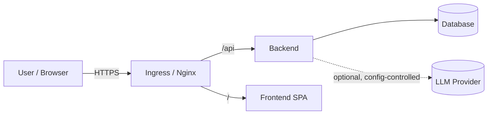

# ADIP Threat Model

A STRIDE-based threat model for ADIP. Scope: the backend API, frontend SPA,
database, and the optional LLM provider. Pairs with `OWASP Checklist.md`.

---

## 1. Assets

- SDLC data (projects, requirements, artifacts, audit trail).
- Prompts & prompt library (potential IP).
- Generated artifacts (may contain sensitive design/compliance detail).
- Configuration & secrets (DB URL, future provider keys).

## 2. Trust boundaries

Boundaries: Internet↔Edge, Edge↔Backend, Backend↔DB, Backend↔LLM.

## 3. STRIDE analysis

| Threat | Example | Mitigation | Residual |
|---|---|---|---|
| **S**poofing | Impersonating a user | ⛔ Add authentication (OIDC/SSO). Today: network-restricted deployment. | High until auth added |
| **T**ampering | Modifying requests/DB | Pydantic validation; ORM; additive migrations; DB access controls. | Low |
| **R**epudiation | Denying an action | Audit trail + correlation id per request. Add user identity once auth exists. | Medium |
| **I**nformation disclosure | Leaking artifacts/secrets | No secrets by default; `DEBUG=false`; error envelope hides internals; secrets via vault/secret. | Medium |
| **D**enial of service | Flooding the API / LLM | Rate limiting middleware; circuit breaker; HPA; timeouts. | Low–Medium |
| **E**levation of privilege | Gaining admin rights | ⛔ No roles yet; add RBAC with auth. | High until RBAC added |

## 4. LLM-specific threats

| Threat | Mitigation |
|---|---|
| Prompt injection (via project data) | Deterministic mode by default; when LLM enabled, treat model output as untrusted, validate structure (structured output validation), never execute model output. |
| Data exfiltration to a cloud model | Local-first (Ollama); cloud providers are opt-in and configured, not user-supplied. Document data-handling before enabling. |
| Hallucinated compliance claims | AI Reviewer + quality scoring flag risk; artifacts marked AI-generated pending review. |

## 5. Top recommendations (prioritized)

1. **Authentication + RBAC** before any external exposure (addresses Spoofing/EoP/Repudiation).
2. **Secrets via vault/operator**, rotate regularly; keep secret scanning in CI.
3. **Enforce rate limiting + secure headers** in production.
4. **Image provenance/signing** in the release pipeline.
5. **Data-handling policy** for enabling cloud LLMs / RAG.
