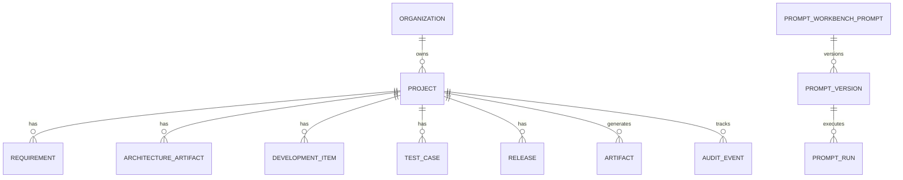

# Database ER Overview (Role 2 / 18)

> Canonical schema: `backend/app/models/`, migrations in `backend/alembic/versions/`.  
> Full guide: `docs/11_Database/Production Database Guide.md`

## Core entities (banking SDLC)

## Index recommendations

| Table | Index | Rationale |
|-------|-------|-----------|
| `projects` | `(organization_id, code)` | Portfolio lookups |
| `artifacts` | `(project_id, artifact_type, created_at DESC)` | Catalog queries |
| `audit_events` | `(project_id, created_at DESC)` | Timeline |
| `prompt_runs` | `(prompt_id, created_at DESC)` | Workbench history |

## Partition / archival

- **Partition:** `audit_events` by month for Postgres deployments >10M rows
- **Archival:** Move artifacts >24 months to cold storage bucket; retain metadata row
- **Backup:** `backend/scripts/db/backup.sh` (see Production Database Guide)
- **Restore:** `backend/scripts/db/restore.sh`

## Sizing estimate (demo → prod)

| Tier | Projects | Artifacts | DB size |
|------|----------|-----------|---------|
| Demo | 5 | 500 | <100 MB SQLite |
| Pilot | 50 | 10K | ~2 GB Postgres |
| Enterprise | 500 | 500K | ~50 GB Postgres + object store |

## Slow query guide

1. Enable `sql_echo` in dev; use `EXPLAIN ANALYZE` on Postgres
2. Avoid N+1 in `sdlc_service` aggregations — use `repositories/aggregation.py`
3. Paginate all list endpoints (`core/pagination.py`)
