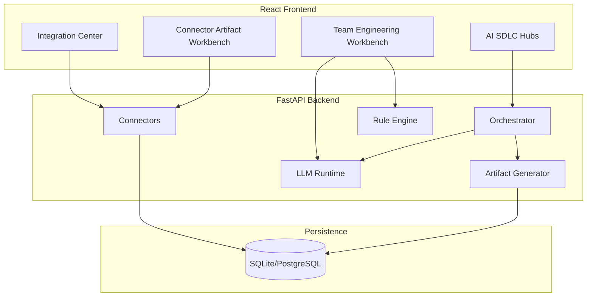

# High-Level Design

## Business context

ADIP accelerates regulated enterprise SDLC (banking/payments) with AI-assisted requirements, architecture, development, testing, and release — grounded in traceability, compliance, and connector-sourced evidence.

## Product capabilities

- Executive and portfolio governance views
- AI SDLC hubs with prompt → analysis → artifacts
- Connector ingestion (Jira, SharePoint, SonarQube, etc.)
- Artifact generation (40+ types) with quality scoring
- Prompt workbench, benchmark, regression
- Local LLM and cloud provider abstraction

## Major modules

## Deployment view

See `10_DEVOPS_GUIDE.md`. Summary: Docker images → Helm chart → K8s ingress; PostgreSQL in production; SQLite for dev/test.

## Integration view

24 enterprise connectors via `backend/app/connectors/`. See `enterprise/connectivity/README.md`.

## AI/LLM view

Provider-agnostic LLM layer (`backend/app/llm/`) with mock-first demo mode. Prompt templates in `prompt_template_library.py` and `connector_artifact_prompts.py`.
