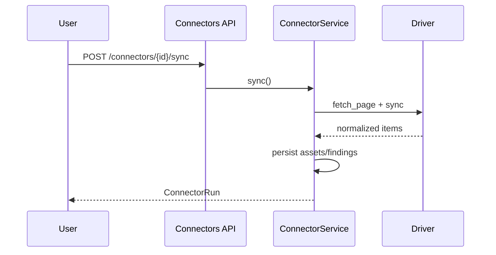
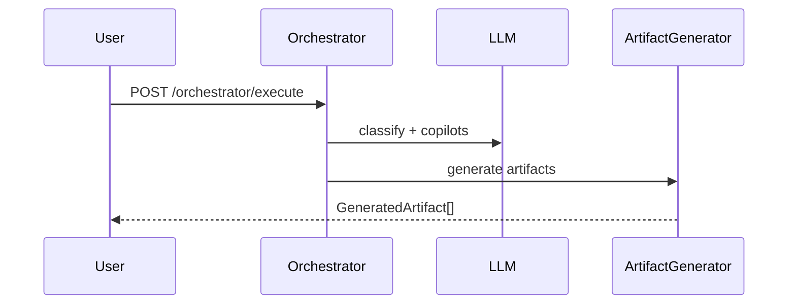
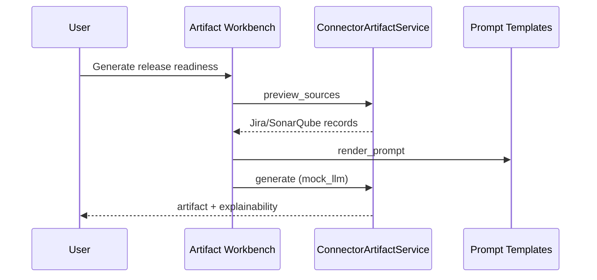

# Low-Level Design

## Backend packages

| Package | Purpose |
|---------|---------|
| `app/api/v1/endpoints/` | REST routers |
| `app/services/` | Business logic |
| `app/models/` | SQLAlchemy ORM |
| `app/schemas/` | Pydantic DTOs |
| `app/connectors/` | Connector framework |
| `app/llm/` | Provider abstraction |
| `app/ml/` | Evaluation, drift, hallucination |
| `app/ai/` | Planning, reasoning, artifact ops |

## Frontend packages

| Path | Purpose |
|------|---------|
| `src/pages/` | Center/hub pages |
| `src/sdk/hooks/` | Data hooks with mock fallback |
| `src/services/backend/` | apiClient, apiConfig |
| `src/components/workflow/` | AIWorkspacePanel |
| `src/components/workbench/` | RuleResultsPanel |

## Database entities

See `enterprise/database/ER_OVERVIEW.md`. Key groups: organization/projects, SDLC phases, connectors (`enterprise_connectors`, runs, assets, findings), prompt workbench.

## Connector flow

## Prompt execution flow

## Artifact generation from connectors

See `02_LOW_LEVEL_DESIGN` companion: `docs/04_Architecture/ADR/`.
