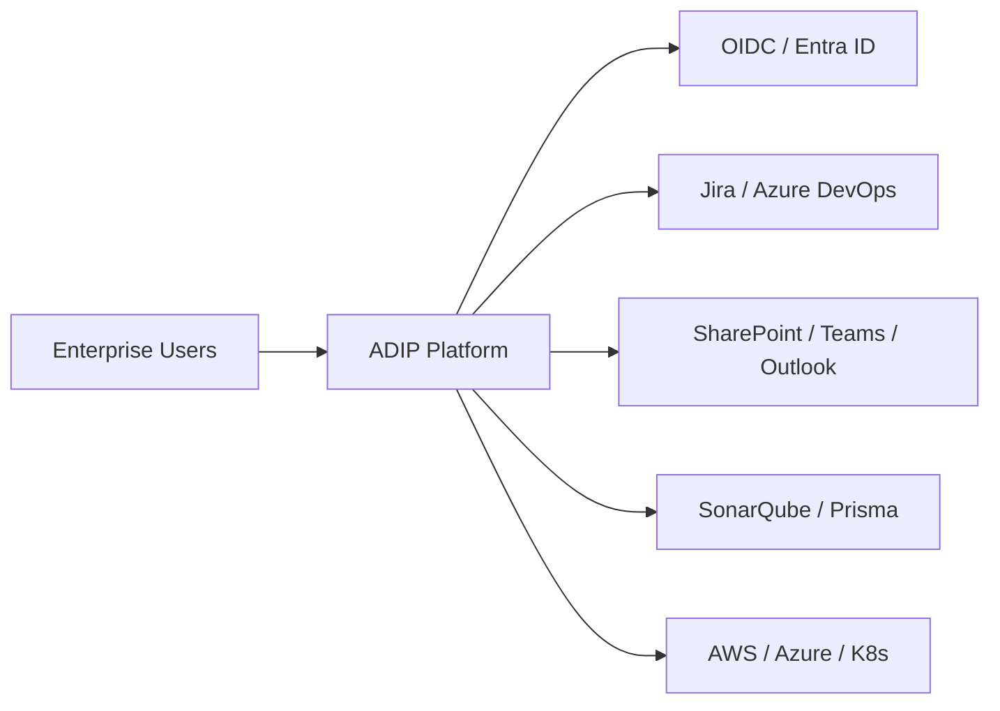
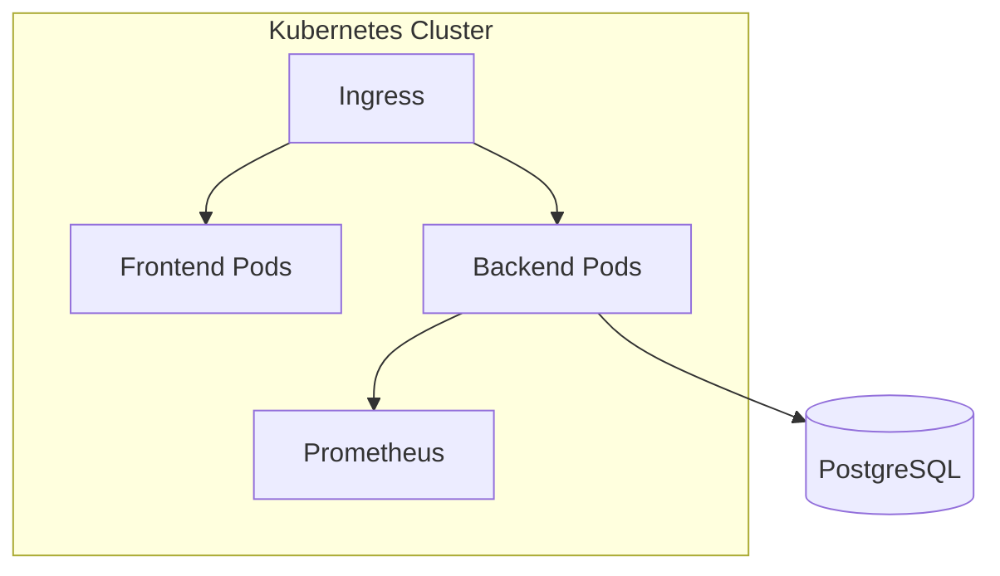
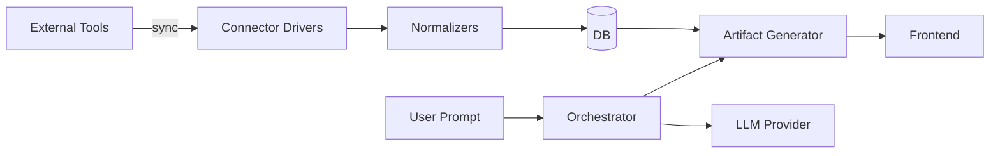

# High-Level Solution Architecture

## Enterprise architecture

## Logical architecture

| Layer | Components |
|-------|------------|
| Presentation | React 19, Vite, MUI, SDK hooks |
| API | FastAPI, OpenAPI, DI via `deps.py` |
| Domain | Services, connectors, orchestrator, rules |
| AI | LLM adapters, prompt engines, ML eval |
| Data | SQLAlchemy, Alembic, seed |

## Physical architecture

- **Dev:** single machine, SQLite, mock connectors, `ADIP_AUTH_MODE=demo`
- **Staging:** K8s, PostgreSQL, OIDC, mock or sandbox connectors
- **Prod:** HA backend, managed DB, OIDC + RBAC/ABAC, live connectors with vault creds

## Deployment architecture

## Data flow architecture

See also `enterprise/database/ER_OVERVIEW.md` and `docs/04_Architecture/ARCHITECTURE.md`.
