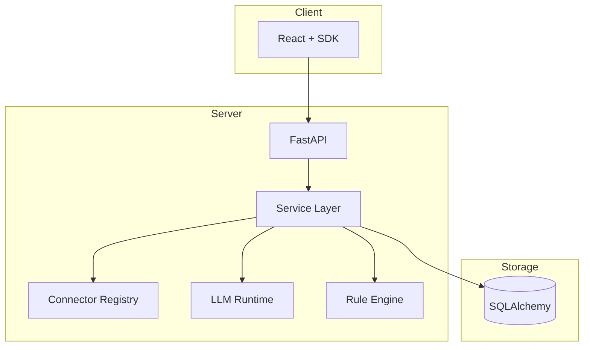

# Technical Architecture

## Stack

| Layer | Technology |
|-------|------------|
| API | FastAPI, Uvicorn, Pydantic v2 |
| ORM | SQLAlchemy 2.x, Alembic |
| Frontend | React 19, Vite 8, TypeScript, MUI |
| LLM | Provider registry + adapters |
| Observability | Prometheus metrics, structured logs |

## Technical architecture diagram

## Key patterns

- **Mock-first:** `isBackendMode()` / `mock_mode` for demos
- **DI:** `get_db()` in `app/api/deps.py`
- **Additive migrations:** ADR-0006
- **Provider abstraction:** ADR-0002

## Observability

- `/health`, `/ready`, `/metrics/prometheus`
- Connector metrics: `adip_connector_*`
- LLM prompt log: `/api/v1/llm/prompt-log`

Cross-reference: `docs/04_Architecture/ARCHITECTURE.md`, `04_Architecture/Plugin Architecture.md`.
