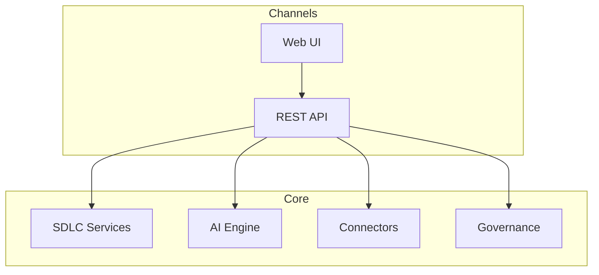
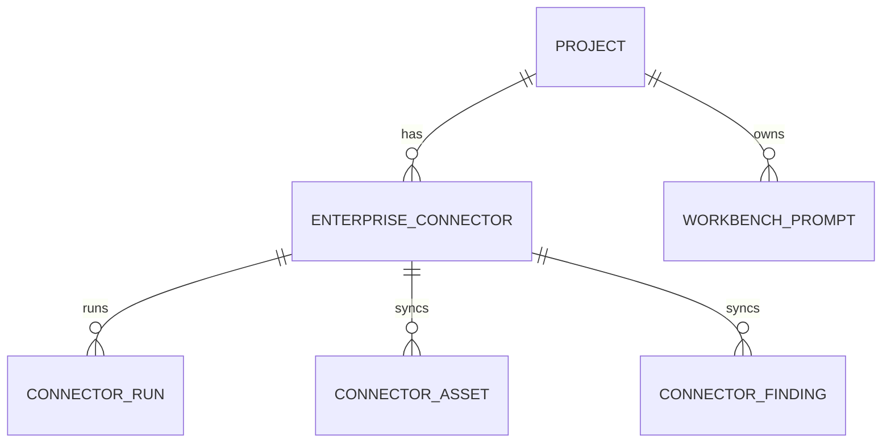

# Enterprise Architecture

## Business architecture

ADIP supports portfolio governance, AI SDLC delivery, risk/compliance, and transformation PMO for regulated enterprises.

## Application architecture

## Data architecture

- Transactional: projects, artifacts metadata, connector sync state
- Reference: prompt templates, golden dataset (`docs/examples/golden-dataset/`)
- JSONL ML datasets: `docs/examples/enterprise-datasets/`

## Integration architecture

See `enterprise/connectivity/ENTERPRISE_CONNECTIVITY_ARCHITECTURE.md`.

## Security architecture

- Prototype: `ADIP_AUTH_MODE=demo|disabled` (bypass with warnings)
- Production: OIDC + RBAC/ABAC (`docs/15_Security/`)
- Credential refs only in connector config

## Operations architecture

SRE runbooks: `09_OPERATIONS_RUNBOOK.md`, `enterprise/connectivity/SRE_RUNBOOK.md`.

## Database ER overview

Full ER: `enterprise/database/ER_OVERVIEW.md`.
