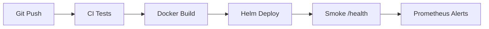

# DevOps Guide

Additive to `enterprise/connectivity/DEVOPS_DEPLOYMENT_NOTES.md` and `docs/13_Deployment/`.

## Docker

Build from repo Dockerfiles (see CI `docker-build.yml`).

## Helm

```bash
helm upgrade --install adip deploy/helm/adip/ -f values.yaml
```

Key values: `backend.env.ADIP_AUTH_MODE`, `CONNECTOR_DEFAULT_MOCK`, `secrets.existingSecret`.

## Terraform

Skeleton at `deploy/terraform/` — extend for cloud-specific infra.

## CI/CD

`.github/workflows/`: `backend-ci.yml`, `frontend-ci.yml`, `docker-build.yml`, `security-scan.yml`.

## Environment variables

See `backend/.env.example`, `deploy/.env.example`.

## Deployment flow



## Deployment checklist

- [ ] `ADIP_AUTH_MODE=oidc` in prod
- [ ] PostgreSQL URL in secret
- [ ] Ingress TLS configured
- [ ] `CONNECTOR_DEFAULT_MOCK=false` only when creds ready
- [ ] Grafana dashboard imported

## Release checklist

- [ ] `pytest -q` pass
- [ ] `npm run build` pass
- [ ] OpenAPI regenerated
- [ ] Alembic migration reviewed
- [ ] Run `scripts/run_llm_smoke_test.py`
