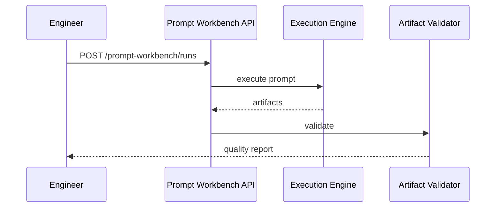

# GenAI Engineering Guide

## Prompt templates

- Banking library: `app/services/prompt_template_library.py`
- Connector artifacts: `app/connectors/connector_artifact_prompts.py`
- LLM copilot templates: `app/llm/templates.py`

## Prompt execution

`POST /api/v1/orchestrator/execute` — `PromptExecutionEngine`.

## Prompt workbench

`POST /api/v1/prompt-workbench/runs` — versioned prompts + runs.

## Artifact generation

`ArtifactGenerator` — 40+ types from SDLC summaries.  
Connector path: `ConnectorArtifactService.generate()`.

## AI reviewer

`POST /api/v1/ai-review/*` — artifact critique.

## Provider abstraction

`app/llm/registry.py`, adapters in `app/llm/adapters/`.

## Local LLM

Ollama adapter — `docs/00_Start_Here/07_Local_LLM_Quick_Start.md`.

## Benchmarking

`POST /api/v1/prompt-benchmark/run`, CLI `python -m app.cli benchmark`.

## Prompt workbench evaluation sequence

Cross-reference: `docs/05_Workbench/Prompt Workbench.md`.
