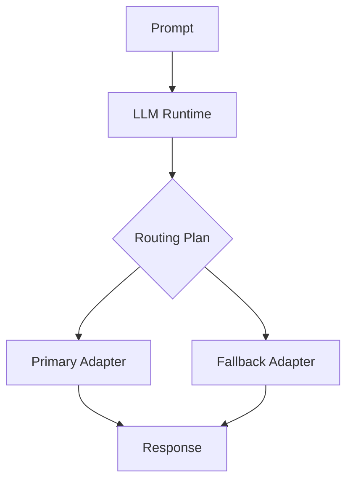

# LLM Operations Guide

## Providers

OpenAI, Claude, Gemini, Mistral, DeepSeek, Qwen, Llama, Ollama, LM Studio — `app/llm/adapters/`.

## Operations endpoints

| Endpoint | Purpose |
|----------|---------|
| `GET /llm/models` | Registry |
| `GET /llm/providers` | Availability |
| `GET /llm/health` | Health |
| `GET /llm/runtime` | Concurrency, circuit breaker |
| `GET /llm/estimate` | Token/cost estimate |
| `POST /llm/smoke-test` | Mock smoke (no credentials) |

## Streaming / batch

Runtime in `app/llm/runtime.py` — extend for production streaming.

## Retry / timeout / fallback

`RetryPolicy` in connectors; LLM runtime routing via `routing_plan()`.

## Smoke test

```bash
python scripts/run_llm_smoke_test.py
```

## Local Ollama

Set `LOCAL_LLM_ENABLED=true`, run Ollama locally. Mock mode works without Ollama.

## LLM execution flow



Cross-reference: `docs/08_Local_LLM/`, `16_LLM_OPERATIONS` companion in `docs/00_Start_Here/07_Local_LLM_Quick_Start.md`.
