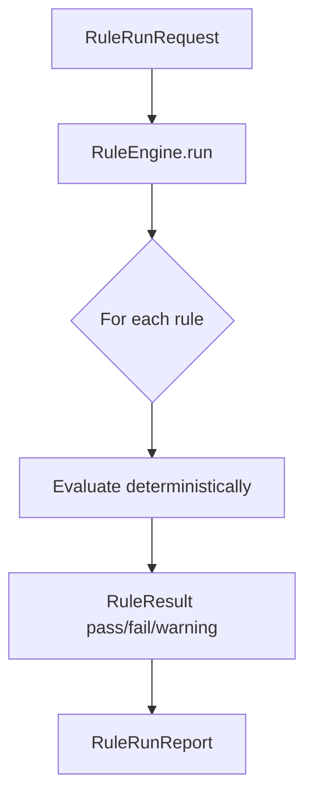

# Rule Engine Guide

Deterministic automation without LLM — `backend/app/services/rule_engine.py`.

## Rule categories

| Category | Examples |
|----------|----------|
| `sdlc_completeness` | Minimum sections, content length |
| `requirement_quality` | Numbered REQ IDs, traceability refs |
| `architecture_quality` | Components, design decisions |
| `test_evidence` | CI references, coverage |
| `release_readiness` | Blockers, quality gate |
| `security_mapping` | Severity normalization |
| `connector_classification` | Classification on records |
| `audit_evidence` | Control/evidence keywords |
| `traceability` | Orphan external_id detection |
| `artifact_naming` | snake_case types, version stamps |

## APIs

- `GET /api/v1/rules` — list rules
- `POST /api/v1/rules/run` — execute against artifact/connector context
- `POST /api/v1/rules/explain` — per-rule explainability

## Rule engine flow

## Frontend

`RuleResultsPanel` in Team Engineering Workbench (`/platform/team-engineering-workbench`).

## Script

No dedicated script — use `scripts/run_artifact_quality_check.py` which includes rule report in scorecard.

## Extending rules

Add `_RuleSpec` entry in `RuleEngine._specs()` with a `_rule_*` method returning `RuleResult`.
