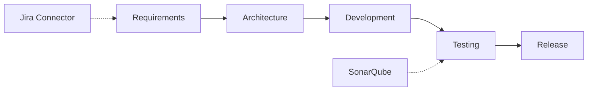

# Demo Script

Combines management, connector, artifact, prompt workbench, and traceability demos.

## 1. Platform overview (3 min)

- Executive Delivery Health → AI SDLC hubs
- Show traceability in Requirements/Testing hubs

## 2. Integration Center (3 min)

`/administration/integrations` → Seed → Test Jira → Sync SonarQube

## 3. Connector artifact generation (4 min)

`/ai-sdlc/connector-artifact-workbench`  
Release readiness → Preview → Generate → Explainability

## 4. Team Engineering Workbench (3 min)

`/platform/team-engineering-workbench`  
- LLM smoke test  
- Golden regression  
- Quality scorecard  
- Rule results

## 5. Prompt workbench (2 min)

API demo: `POST /api/v1/prompt-workbench/runs` or Swagger `/docs`

## 6. Traceability (2 min)

Traceability Center — requirement → test → release chain

## Traceability flow

Full connector demo: `enterprise/connectivity/DEMO_SCRIPT_MANAGEMENT_REVIEW.md`.
